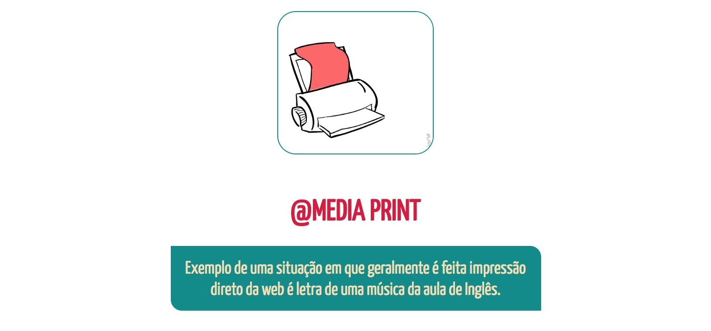

# Media Print

Para cada opção que o usuário possa ter, em muitos casos, há uma solução para que essa experiência seja a melhor. Uma das opções que é oferecida através do navegador é a impressão de uma página web, podendo ser uma lista de filmes que irão estrear nos próximos meses ou aquela receita de pão de ló da vovó. Porém, quando se é posto para imprimir, a página fica um tanto indesejável, seja porque o menu de navegação tenha sido impresso junto ou a imagem de exemplo do pão de ló tenha sido distorcida.

Contudo, já existe uma solução para esta façanha e ela se chama Media Print!

O @Media Print é uma das opções de Media Queries que adapta o conteúdo de uma página web para a impressão. Assim como o Media Screen adapta o conteúdo de uma página desktop para uma página mobile.

Apesar de ser um tanto desconhecido, esse tipo de adaptação não deixa de ser importante, pois existem usuários que fazem impressões e não necessariamente de um arquivo ou página web pré-determinada para isto.

Além de um menu de navegação desnecessário em uma folha impressa, há também questões de formatação, como uma cor ter mudado ou uma div que tenha crescido ou diminuído demais. Para isso nós usamos o Media Print e determinamos as propriedades, assim como no Media Screen.


### Exemplo de Media Print:
```
  @media print {
    .container {
      border-top: solid 8px gray;
      background-color: green;
    }
  }

```

### Bem parecido com o Media Screen:
```
  @media screen and (min-width: 900px) {
    .container {
      border-top: solid 1px gray;
      background-color: blue; 
    }
  } 

```

#### Devemos tomar cuidado em relação às cores, pois há retirada de algumas delas e mudanças de tonalidade!




Exemplo da página web ao ser direcionada para a impressão

<!--  -->


#### Para manter as mesmas cores podemos usar:

```
  @media print and (color) {
    * {
      -webkit-print-color-adjust: exact;
      print-color-adjust: exact;
    }
  }
```

A mesma página web sendo direcionada para a impressão com o @media print

<!--  -->


Dito sobre o Media Print, há mais uma opção para a resolução e melhoria de página web impressa que é o Page! 

Basicamente ele é bem parecido com o @Media Print, porém mais optado se as mudanças para a impressão forem melhor relacionadas a formatação do espaçamento e a forma como o conteúdo deve se encaixar para que fique alinhado dentro da folha.

### Exemplo de uso do @Page:

```
  @page {
    margin: 36px;
    padding-bottom: 20px;
 }
```

#### Obs: Em relação a impressão é indicado que se troque a unidade de medida como “px” para “pt” em caso de font-size ou “px” para “cm” em caso de alinhamento.


Constatando, não se esqueça que uma impressão, apesar de ter o direito de ficar bonita, ela precisa se manter útil e passar a informação contida na página web que foi extraída. Nada de banners, propagandas ou menu de navegação em papel!

##### Já dizia o urso Balu de Mogli: “Somente o necessário, o extraordinário é demais.”